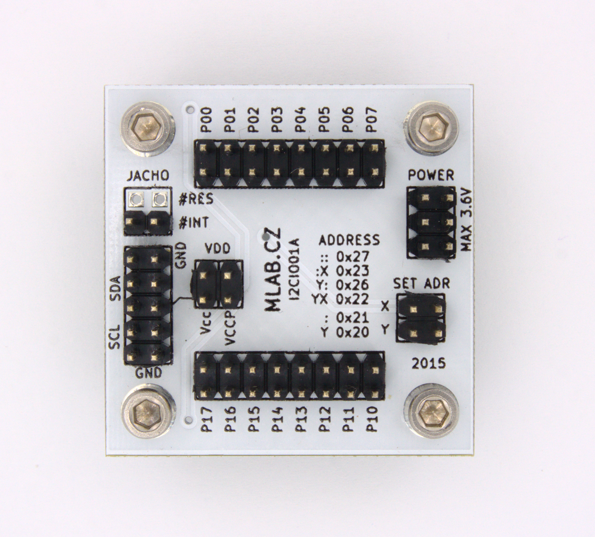

# I2CIO01A - I2C IO Expander

## Overview

The I2CIO01 module is a GPIO expander designed for operation in the range of 1.65 to 5.5 V. It provides general-purpose remote I/O expansion via the I²C interface. The module comprises two 8-bit Configurable, Input Ports, Output Port, and Polarity Inversion registers.

## Features

- **Operating Voltage:** 1.65 to 5.5 V
- **Interfaces:** I²C, up to 400 kHz
- **GPIO Ports:** 16-bit expansion using either TCA6416A or TCA9535 IC
- **Address Selection:**
  - TCA6416A: 2 I2C addresses, includes a reset pin
  - TCA9535: 4 I2C addresses
- **Interrupt Capabilities:** Both ICs support interrupt output
- **Package Dimensions:** 40.13 x 40.13 x 16 mm

## Technical Specifications

| Parameter        | Value        | Note                                |
|------------------|--------------|-------------------------------------|
| Power Supply     | Max. 3.6 V   |                                     |
| ICs Used         | TCA6416A or TCA9535 |                              |
| Interface bus        | I²C          | Frequency up to 400 kHz             |
| Main Usage       | I²C IO expander |                                     |
| Dimensions       | 40.13 x 40.13 x 16 mm | Height above the baseboard   |

## Design Details

### IC Selection variants
- **TCA6416A:**
  - Populate RES, do not populate ADR X
  - Jumper to Vccp and VDD
- **TCA9535:**
  - Do not populate RES, populate ADR X
  - Jumper to Vccp and VDD

### Schematic and Layout

The module's design and layout files can be found in the `hw/sch_pcb` directory. The board is designed using KiCad.

## Bill of Materials

| Designator      | Type                    | Package                    | Quantity |
|-----------------|-------------------------|----------------------------|----------|
| J3              | JUMP_3X2                | Pin_Header_Straight_2x03   | 1        |
| R1, R2, R3, ... | 10k                     | SMD-0805                   | 13       |
| U1              | TCA6416A                | TSSOP-28                   | 1        |
| J8, J5          | CONN1_2                 | Pin_Header_Straight_1x02   | 2        |
| P1, P2, P3, P4  | MountingHole_3mm        |                            | 4        |
| J1              | JUMP_2X2                | Pin_Header_Straight_2x02   | 1        |
| J2              | JUMP_5X2                | Pin_Header_Straight_2x05   | 1        |
| J6, J7          | JUMP_8X2                | Pin_Header_Straight_2x08   | 2        |
| J4, J9          | CONN_2                  | Pin_Header_Straight_1x02   | 2        |
| C1              | 10uF                    | SMD-0805                   | 1        |
| C2              | 100nF                   | SMD-0805                   | 1        |
| D1              | BZV55C-3,6V             | Diode-MiniMELF_Standard    | 1        |

## Assembly and Testing

1. **Assembly:** Follow the provided schematic and BOM for assembling the module.
2. **Initial Inspection:** Perform a visual inspection to ensure no shorts on the power supply.
3. **Testing:** No additional setup is required beyond the initial inspection.

For more detailed information on each component, please refer to their respective datasheets:

- [TCA6416A Datasheet](https://www.ti.com/product/TCA6416A)
- [TCA9535 Datasheet](https://www.ti.com/product/TCA9535)

## Contributing

Contributions are welcome! Please fork this repository and submit a pull request with your changes.

## Contact

For more information, visit the [MLAB website](http://www.mlab.cz) or contact us at support@mlab.cz.
